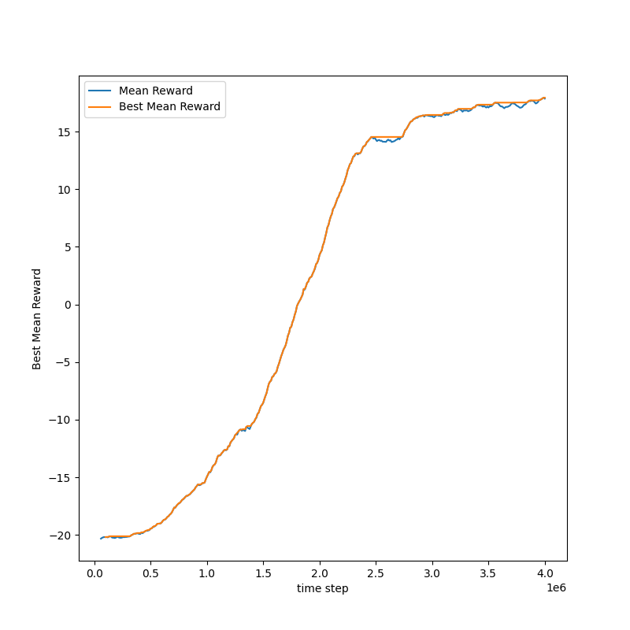
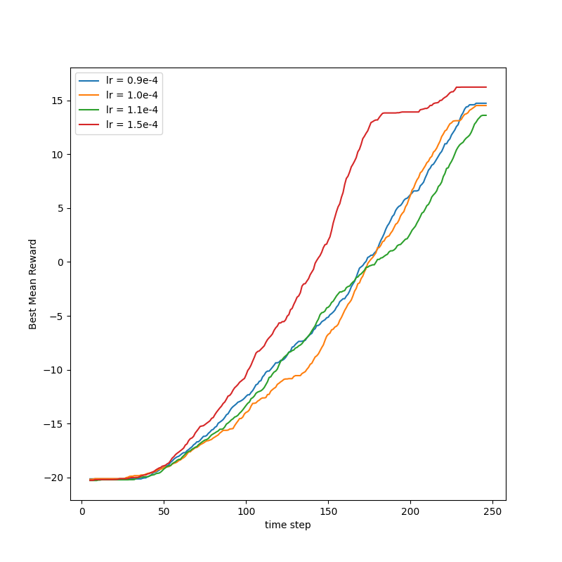

# CS294-112 HW 3: Q-Learning

Dependencies:
 * Python **3.5**
 * Numpy version **1.14.5**
 * TensorFlow version **1.15.0**
 * MuJoCo version **1.50** and mujoco-py **1.50.1.56**
 * OpenAI Gym version **0.10.5**
 * seaborn
 * Box2D==**2.3.2**
 * OpenCV
 * ffmpeg

Before doing anything, first replace `gym/envs/box2d/lunar_lander.py` with the provided `lunar_lander.py` file.

The only files that you need to look at are `dqn.py` and `train_ac_f18.py`, which you will implement.

See the [HW3 PDF](http://rll.berkeley.edu/deeprlcourse/f17docs/hw3.pdf) for further instructions.

The starter code was based on an implementation of Q-learning for Atari generously provided by Szymon Sidor from OpenAI.

## Our Answers
[Uğur İpekdüzen](https://github.com/UgurIpekduzen) was my teammate in this homework.

### Question 1
The plot showing the performance of our implementation on the game Pong.

  

### Question 2
We chose learning rate and ran three other settings of this hyperparameter, and plotted all four values on the same graph including the original one (lr=1.0e-4). 
Our choices are 0.9e-4, 1.1e-4 and 1.5e-4.

As a result lr=1.5e-4 is the best performer among these options in 2.5 million steps.

  Note: x axis' values should be multiplied by 1e4

